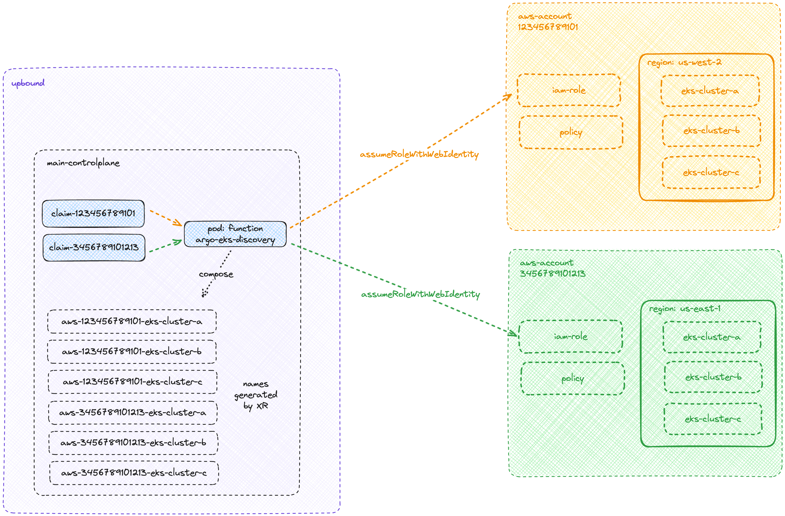

# function-argo-eks-discovery
## Overview

`function-argo-eks-discovery` is a specialized Crossplane function designed to seamlessly integrate Amazon Web Services (AWS) Elastic Kubernetes Service (EKS) clusters with ArgoCD for continuous deployment. This function provides a unique solution for automatically discovering existing AWS EKS clusters and creating corresponding managed resources of kind `Cluster` from the `provider-argocd`. This enables direct integration of these clusters with ArgoCD, facilitating automated deployment and management processes.



## Features

- **EKS Cluster Discovery:** Automatically discovers existing AWS EKS clusters, easing the manual burden of tracking and integrating multiple clusters.
- **Filtering Capability:** Allows users to filter clusters based on specific tags, ensuring that only relevant clusters are selected for ArgoCD integration.
- **ArgoCD Integration:** Creates managed resources for ArgoCD, enabling it to interact with and deploy to the discovered EKS clusters.
- **Auto-Discovery for New Clusters:** Continuously monitors for new AWS EKS clusters and integrates them with ArgoCD, keeping the deployment environment up-to-date.

## Function Workflow

The `function-argo-eks-discovery` performs the following actions:

1. **Retrieve Input Parameters:** Gathers necessary parameters and information from the input request to tailor the discovery process.

```
apiVersion: argo.discover.upbound.io/v1alpha1
kind: EKS
metadata:
  name: aws-609897127049
  namespace: default
spec:
  parameters:
    argoRoleArn: arn:aws:iam::123456789101:role/argocd
    assumeRoleWithWebIdentityArn: arn:aws:iam::123456789101:role/eks-reader
    region: "us-west-2"
    search:
      key: "argocd-autodiscover"
      value: "true"
```

2. **Initialize AWS Session and EKS Client:** Uses the AWS SDK for Go to establish a session and create an EKS client, enabling interaction with AWS services.

3. **List EKS Clusters:** Queries all EKS clusters in the specified AWS region, providing a comprehensive overview of the available Kubernetes environments.

4. **Filter Clusters:** Applies user-defined tags to filter the listed EKS clusters, ensuring that only clusters meeting specific criteria are selected for ArgoCD integration.

5. **Generate ArgoCD Server Managed Resources:** For each cluster that matches the filtering criteria, the function decodes the certificate authority data and endpoint. It then generates a corresponding ArgoCD Server managed resource, which is added to the list of resources to be managed by ArgoCD.

## Usage

To use `function-argo-eks-discovery`, follow these steps:

1. **Configure AWS Credentials:** Ensure that AWS credentials are correctly set up to allow the function to access AWS EKS clusters.

```
apiVersion: iam.aws.upbound.io/v1beta1
kind: Role
metadata:
  name: eks-reader
spec:
  forProvider:
    assumeRolePolicy: |
      {
          "Version": "2012-10-17",
          "Statement": [
              {
                  "Effect": "Allow",
                  "Principal": {
                      "Federated": "arn:aws:iam::<aws-account-nummer>:oidc-provider/proidc.upbound.io"
                  },
                  "Action": "sts:AssumeRoleWithWebIdentity",
                  "Condition": {
                      "StringLike": {
                          "proidc.upbound.io:sub": "mcp:<upbound-org>/<controlplane>:function:upbound-function-argo-eks-discovery",
                          "proidc.upbound.io:aud": "sts.amazonaws.com"
                      }
                  }
              }
          ]
      }
```

2. **Define Filtering Tags:** Specify the tags that will be used to filter EKS clusters for integration with ArgoCD.

3. **Deploy the Function:** Deploy `function-argo-eks-discovery` within your Crossplane environment.

```
apiVersion: pkg.crossplane.io/v1beta1
kind: Function
metadata:
  name: upbound-function-argo-eks-discovery
spec:
  package: xpkg.upbound.io/upbound/function-argo-eks-discovery:v0.1.0
```

4. **Monitor and Manage Resources:** Once deployed, the function will automatically discover and integrate new EKS clusters, which can then be monitored and managed through ArgoCD.
